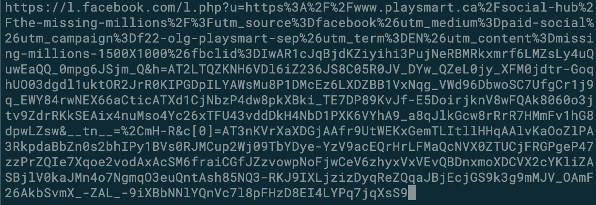

# sterilize-ng
URL sterilizer - remove tracking information from URLs

## Background

The surveillance capitalist economy is built on the relentless tracking of users. Imagine going about town running errands but everywhere you go, someone is quietly following you. When you pop into the grocery, they examine your receipt. They look into the bags to see what you bought. Then they hop in the car with you and keep careful records of where you go, how fast you drive, whom you talk with on the phone. This is surveillance capitalism - the relentless "digital exhaust" left by our actions online.

The techniques employed by surveillance capitalists are multifold, but one of the easiest to fix is the pollution of URLs with tracking parameters. If you visit a link on Facebook by clicking on it, you are actually giving up a wealth of information about yourself unnecessarily. Here's a typical outgoing link that you would find on Facebook:

